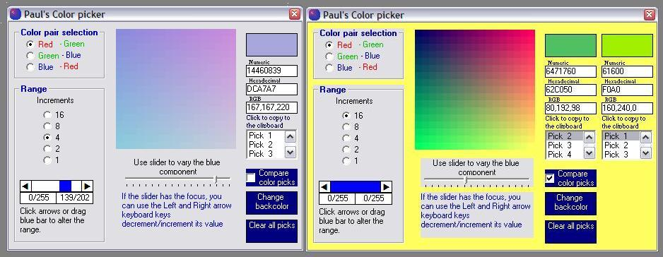



## Paul's Color Picker v 1\.2

### Description

Paul's Color Picker uses an innovative approach to the color selection process. The starting point is

the RGB color model. First a color pair is selected and this color combination is presented in a

17x17 matrix with the colors shown with 16 units increments. Beneath the matrix is a slider allowing

variations of the third color. To further refine the search the increments can be modified down to 1

unit. Other features and credits: see code comments. Paul Turcksin Zip 39KB.

Version 1.2: Implemented Rob C's suggestion by giving the cursor the color the mouse is over.
 
### More Info
 

             |
---                |---
**Submitted On**   |2007-04-22 16:42:56
**By**             |[Paul Turcksin](https://github.com/Planet-Source-Code/PSCIndex/blob/master/ByAuthor/paul-turcksin.md)
**Level**          |Beginner
**User Rating**    |4.9 (34 globes from 7 users)
**Compatibility**  |VB 6\.0
**Category**       |[Graphics](https://github.com/Planet-Source-Code/PSCIndex/blob/master/ByCategory/graphics__1-46.md)
**World**          |[Visual Basic](https://github.com/Planet-Source-Code/PSCIndex/blob/master/ByWorld/visual-basic.md)
**Archive File**   |[Paul's\_Col2070216112007\.zip](https://github.com/Planet-Source-Code/paul-turcksin-paul-s-color-picker-v-1-2__1-68761/archive/master.zip)

